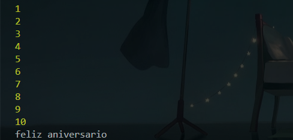

## For Loops

O **for loop** precisa de 3 condicoes para funcionar:

- index
- condicao
- reflexao

### No que podemos utiliza-lo?

o **For** serve para diversas coisas dentro do javascript vamos para um exemplo.

sempre utilizamos o **for** quando quisermos um loop por quantidade *definida* de vezes

Queremos um **codigo** que conte ate 10 para nos e apos isso envie um feliz aniversario, como fariamos sem os loops
### construcao
~~~javascript
for(let index = 0;index<numero;index++){
    //codigo
}

// esse codigo executara qualquer coisa dentro do loop ate o index ser = ou maior que o numero
~~~

#### sem loop
~~~javascript
console.log("1")
console.log("2")
console.log("3")
console.log("4")
console.log("5")
console.log("6")
console.log("7")
console.log("8")
console.log("9")
console.log("10")
console.log("feliz aniversario!")

// feito em 11 linhas, onde o programa teria que percorrer todas elas
~~~
#### com loop
~~~javascript
for(let i = 1;i<=10;i++){
    console.log(i) // printara o valor de i no momento
}
console.log('feliz aniversario')

// feito em 4 linhas
~~~

