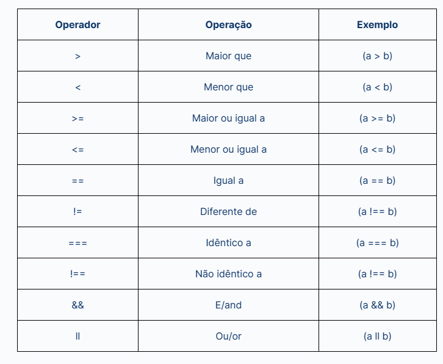
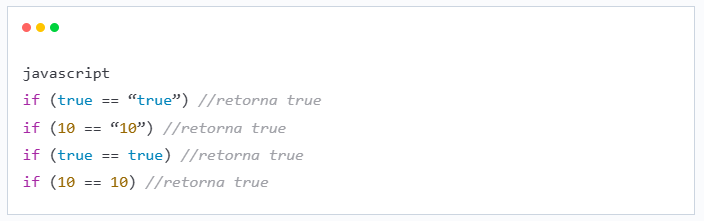
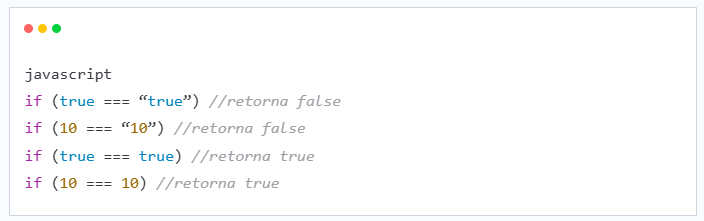
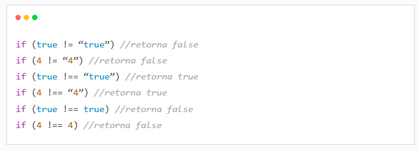

## Operacoes e Comparativos matematicos

No javascript temos as **Operacoes** e os **Comparativos** sendo os comparativos matematicos ou nao

### Operacoes

~~~javascript
// operadores aritimeticos
let soma = 2 + 3; // input = 5
let subtracao = 5 - 2; // input = 3
let multiplicacao = 4 * 6; // input = 24
let divisao = 10 / 2; // input = 5
let resto = 10 % 3; // input = 1

// operadores de atribuicao
let x = 10

x += 5 // input = 15
x -= 5 // input = 5
~~~
### Biblioteca Math
~~~javascript
let numero = 5.7;

console.log("Número original:", numero);
console.log("Math.floor():", Math.floor(numero)); // Saída: 5
console.log("Math.ceil():", Math.ceil(numero)); // Saída: 6 (arredondamento para cima)
console.log("Math.round():", Math.round(numero)); // Saída: 6 (arredondamento para o número mais próximo)
console.log("Math.abs():", Math.abs(-5)); // Saída: 5 (valor absoluto)
console.log("Math.sqrt():", Math.sqrt(25)); // Saída: 5 (raiz quadrada)
console.log("Math.pow():", Math.pow(2, 3)); // Saída: 8 (potência)
console.log("Math.random():", Math.random()); // Saída: um número aleatório entre 0 e 1
~~~

### Comparativos

#### Diferenca entre "==" e "==="
##### ==

##### ===

##### != !==

### AND e OR

#### AND
~~~javascript
let idade = 18
let possuiCNH = true

if(idade >= 18 && possuiCNH === true){
    console.log("pode dirigir") // input = true
}
~~~
#### OR
~~~javascript
let a = 5
let b = 4

if(a || b = 5){
    console.log("eh igual a 5") // input = true
}
~~~
